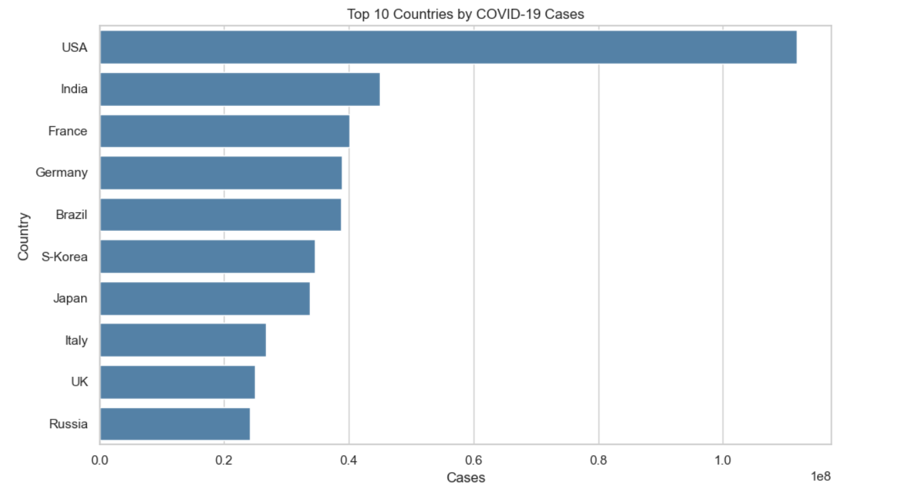
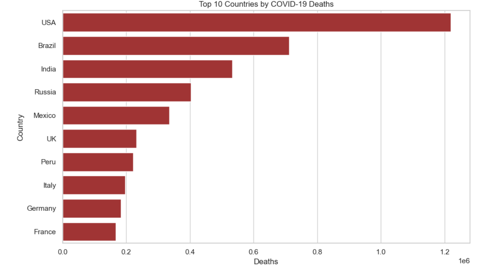
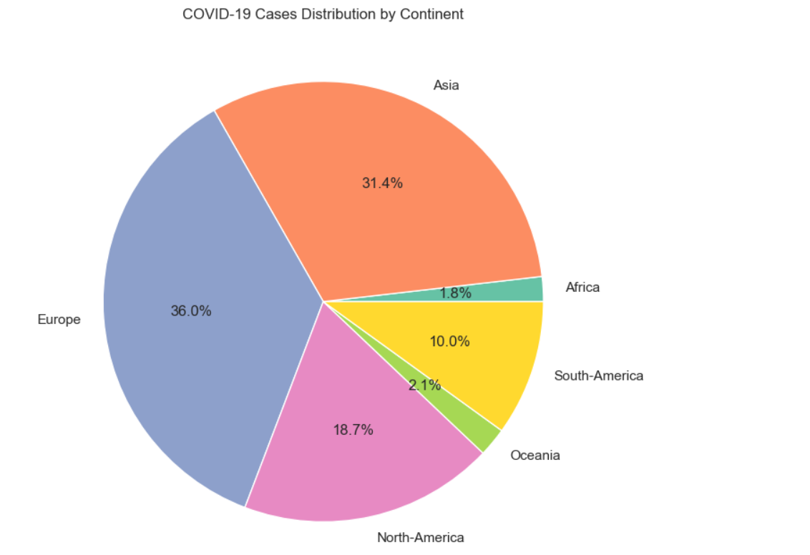
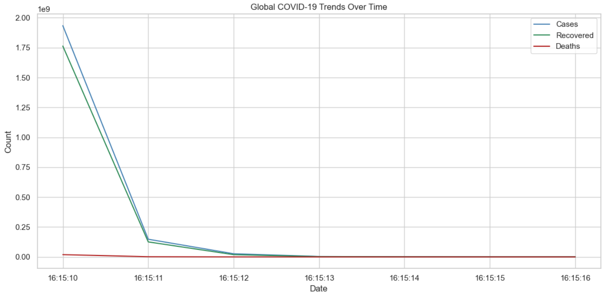
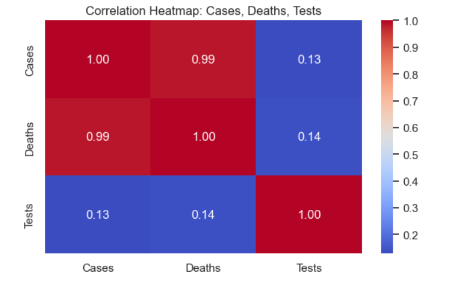
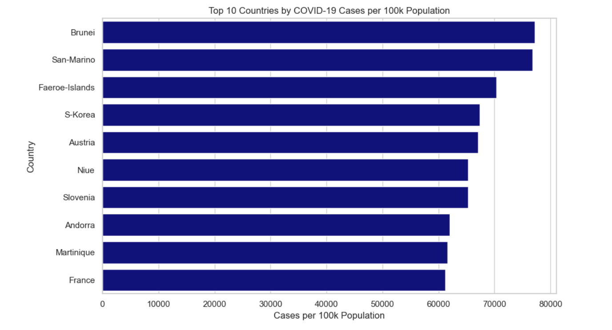

# covid-data-analysis
This project analyzes COVID-19 data using Python and Jupyter Notebook. It includes data visualization and insights from the dataset.
## Student Details
- Name: Suraj Bhan  
- College ID: SBU232295

## Project Description
This project analyzes COVID-19 data using Python and Jupyter Notebook. It includes data visualization and insights from the dataset.

## Screenshots

